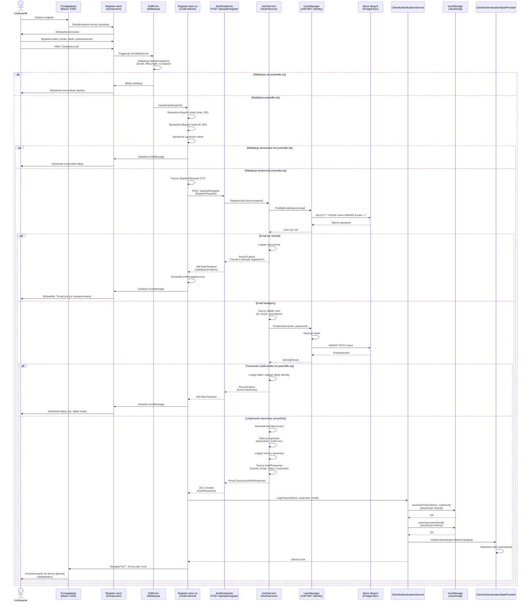
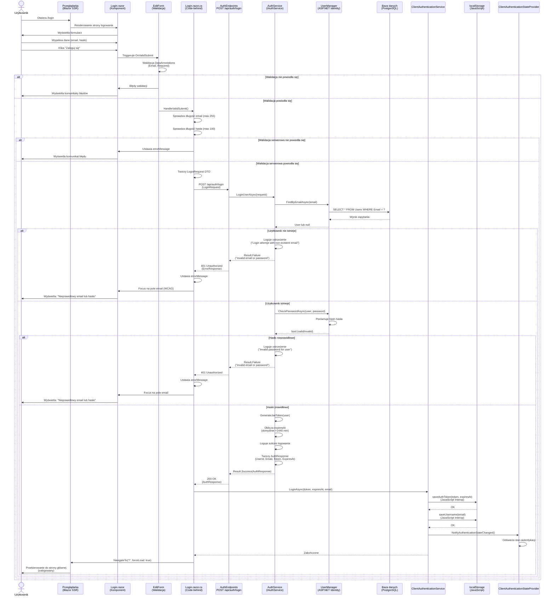
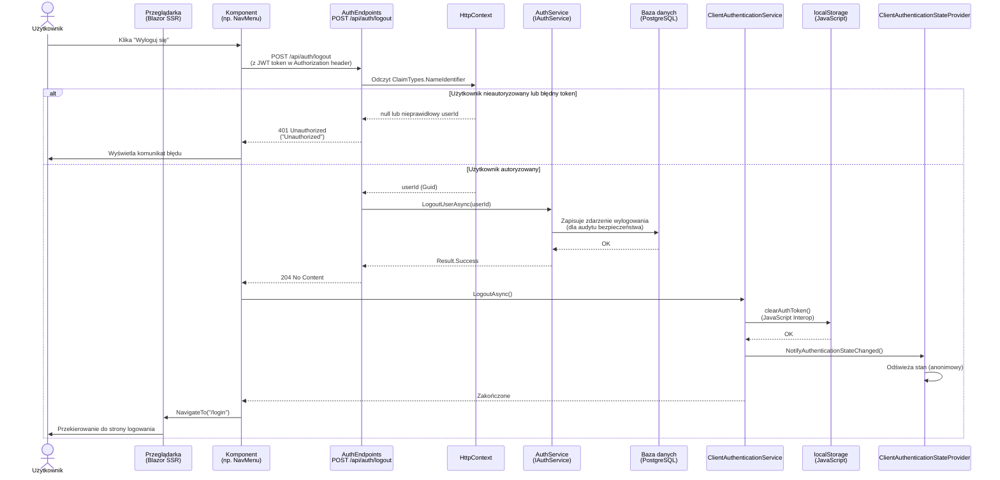
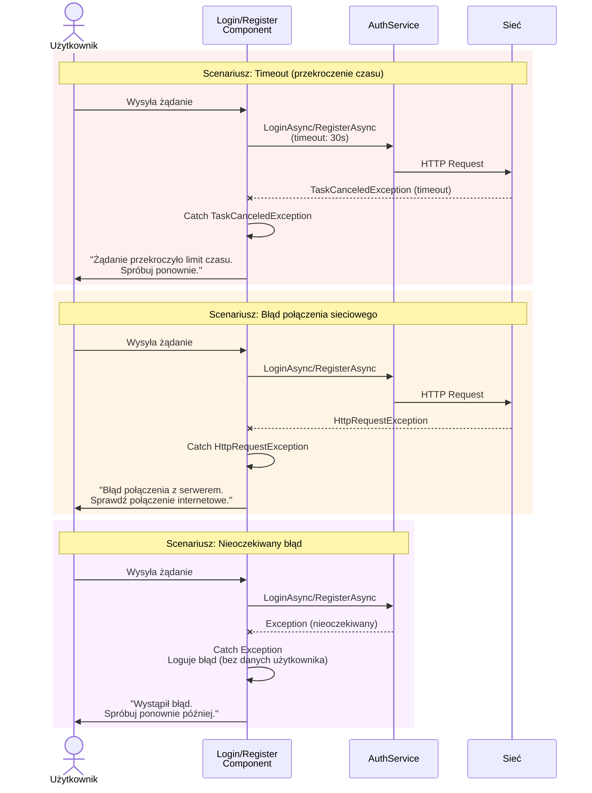
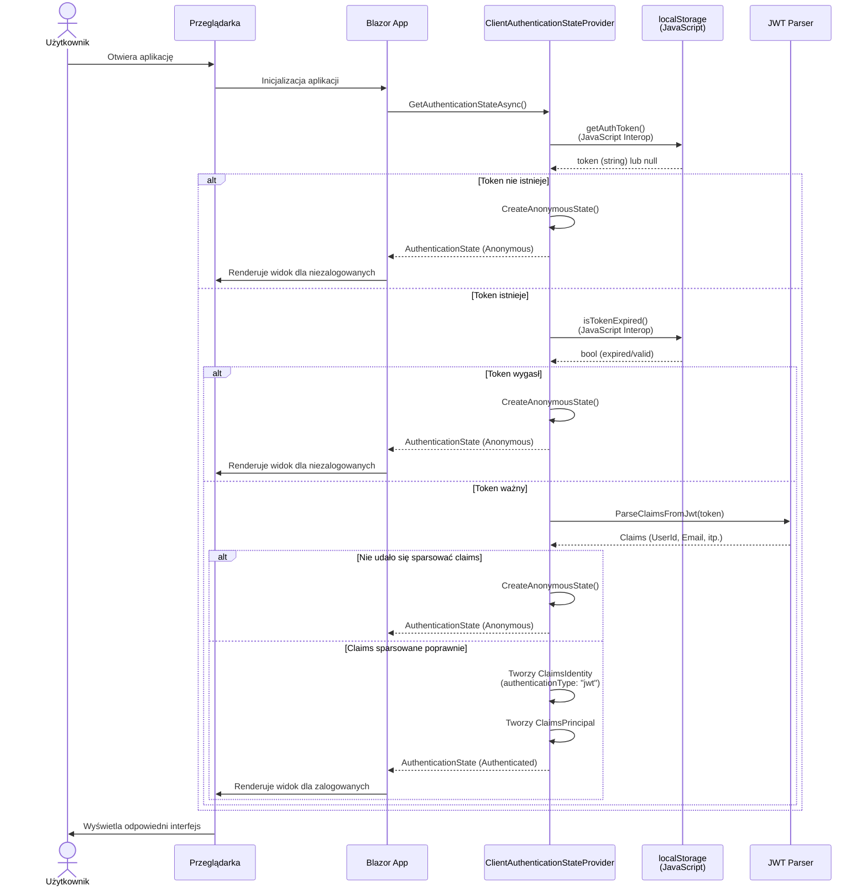

# Diagram przepływu autentykacji - 10xCards

Ten dokument zawiera diagramy sekwencji Mermaid prezentujące przepływ autentykacji dla modułów logowania i rejestracji w aplikacji 10xCards.

## Przepływ rejestracji użytkownika (US-001)

## Przepływ logowania użytkownika (US-002)

## Przepływ wylogowania użytkownika

## Obsługa błędów i przypadków brzegowych

## Sprawdzanie stanu autentykacji przy załadowaniu strony

## Podsumowanie architektury autentykacji

### Komponenty systemu:

1. **Warstwa prezentacji (Blazor SSR)**:
   - `Login.razor` / `Register.razor` - komponenty UI
   - `Login.razor.cs` / `Register.razor.cs` - logika biznesowa komponentów
   - `EditForm` z `DataAnnotationsValidator` - walidacja po stronie klienta

2. **Warstwa API (ASP.NET Core)**:
   - `AuthEndpoints.cs` - endpointy REST API (POST /api/auth/register, /login, /logout)
   - Middleware autentykacji JWT
   - AntiForgeryToken dla ochrony CSRF

3. **Warstwa serwisów**:
   - `AuthService` (IAuthService) - główna logika autentykacji
   - `ClientAuthenticationService` - zarządzanie stanem po stronie klienta
   - `ClientAuthenticationStateProvider` - dostarczanie stanu autentykacji dla Blazor

4. **Warstwa danych**:
   - `UserManager<User>` (ASP.NET Core Identity)
   - Entity Framework Core
   - PostgreSQL

5. **Przechowywanie stanu**:
   - `localStorage` (przeglądarka) - przechowywanie JWT i danych użytkownika
   - JavaScript Interop - komunikacja między Blazor a JavaScript

### Bezpieczeństwo:

- **Hashowanie haseł**: ASP.NET Core Identity (domyślnie PBKDF2)
- **JWT tokens**: Podpisane tokeny z czasem wygaśnięcia (domyślnie 1440 minut)
- **HTTPS**: Wymagane dla produkcji
- **Walidacja wielopoziomowa**: klient → serwer → baza danych
- **Rate limiting**: Zalecane (opisane w komentarzach kodu)
- **Logging**: Audit trail dla zdarzeń bezpieczeństwa (logowanie, wylogowanie, niepowodzenia)
- **Ochrona CSRF**: AntiForgeryToken w formularzach

### Zgodność z PRD:

- ✅ **US-001**: Rejestracja konta z walidacją email i hasła
- ✅ **US-002**: Logowanie z bezpiecznym przechowywaniem danych
- ✅ **US-009**: Bezpieczny dostęp i autoryzacja (JWT, izolacja użytkowników)

### Wymagania RODO:

- Hasła są hashowane i nigdy nie są przechowywane w postaci jawnej
- Dane użytkownika są logowane z zachowaniem ostrożności (bez wrażliwych informacji w logach produkcyjnych)
- System przewiduje możliwość usunięcia konta (endpoint do implementacji zgodnie z US-023)

